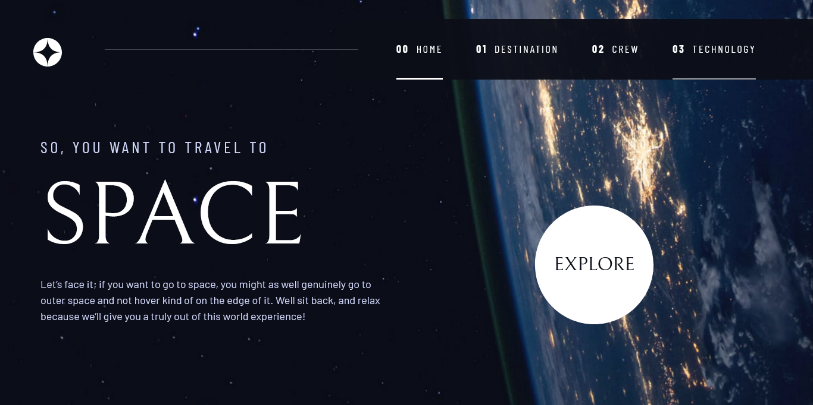

# Frontend Mentor - Space tourism website solution

This is a solution to the [Space tourism website challenge on Frontend Mentor](https://www.frontendmentor.io/challenges/space-tourism-multipage-website-gRWj1URZ3). Frontend Mentor challenges help you improve your coding skills by building realistic projects. 

## Table of contents

- [Overview](#overview)
  - [The challenge](#the-challenge)
  - [Screenshot](#screenshot)
  - [Links](#links)
- [My process](#my-process)
  - [Built with](#built-with)
  - [What I learned](#what-i-learned)
  - [Continued development](#continued-development)
  - [Useful resources](#useful-resources)
- [Author](#author)
- [Acknowledgments](#acknowledgments)


## Overview

### The challenge

Users should be able to:

- View the optimal layout for each of the website's pages depending on their device's screen size
- See hover states for all interactive elements on the page
- View each page and be able to toggle between the tabs to see new information

### Screenshot




### Links

- Solution URL: [Add solution URL here]()
- Live Site URL: [Add live site URL here](https://plainsight16.github.io/FEM--space-tourism/)

## My process

### Built with

- Semantic HTML5 markup
- CSS custom properties
- CSS Grid
- Mobile-first workflow
- JavaScript

### What I learned

Use this section to recap over some of your major learnings while working through this project. Writing these out and providing code samples of areas you want to highlight is a great way to reinforce your own knowledge.

To see how you can add code snippets, see below:

```css
.primary-navigation{
  --gap: clamp(1.5rem, 5vw, 3.5rem);
}
```
I found using clamp really fascinating, how it readjusts the size of property has the viewport changes.

### Continued development

I still want to perfect using CSS grids to make layout for a site.
I also want to use the css property "Clamp" more often in future projects.
I would love to build more projects that involve  glassmorphism.
Also, more practice in css animations. 

### Useful resources

- [css-tricks.com](https://css-tricks.com/snippets/css/complete-guide-grid/#:~:text=CSS%20Grid%20Layout%20(aka%20%E2%80%9CGrid,very%20good%20job%20of%20it.) - This is an amazing article which helped me with CSS grids. I'd recommend it to anyone still learning this concept.


## Author

- Website - [Timilehin Bakare](https://plainsight16.github.io/FEM--space-tourism/)
- Frontend Mentor - [@plainsight16](https://www.frontendmentor.io/profile/plainsight16)
- Twitter - [@Adeniyibaks24](https://www.twitter.com/Adeniyibaks24)


## Acknowledgments

Special thanks to Kevin Powell and scrimba. Kevin's taught me so much about making a css design system, he  helped me see the beauty that using css grids provides.
